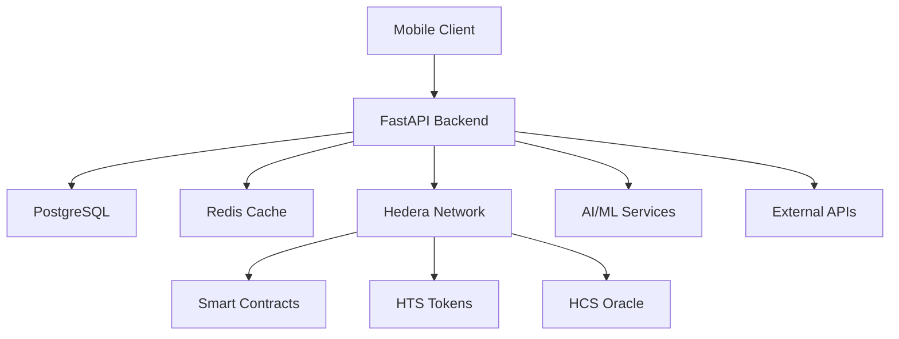

# 🚀 PredictPesa Backend

> **Africa's First DeFi-Native Prediction Market Platform on Hedera Blockchain**

[](https://python.org)
[](https://fastapi.tiangolo.com)
[](https://hedera.com)
[](LICENSE)

PredictPesa transforms predictions into DeFi primitives, allowing users across Africa and globally to stake Bitcoin on real-world outcomes—elections, FX rates, sports, weather, and more. Built on Hedera's ultra-fast consensus with AI-powered market creation and mobile-first UX.

## ✨ Key Features

### 🤖 **AI-Powered Market Creation**
- Natural language processing for market queries
- Automated categorization and optimization
- Confidence scoring and trend analysis

### ₿ **Bitcoin Staking & Tokenization**
- Stake BTC on prediction outcomes
- Tokenized positions as `yesBTC`/`noBTC` HTS tokens
- DeFi composability with AMM pools and yield farming

### 🔮 **Multi-Source Oracle System**
- Chainlink price feeds integration
- Verified journalist reports via HCS
- DAO governance for dispute resolution

### 📱 **Mobile-First African UX**
- USSD interface for basic phones
- Gasless transactions via sponsored transactions
- SMS confirmations and local currency support

### 🌾 **DeFi Integrations**
- AMM liquidity pools for prediction tokens
- Yield farming with LP tokens
- Collateral usage in lending protocols

## 🏗️ Architecture



### Tech Stack
- **Backend**: FastAPI, Python 3.11+, SQLAlchemy, Celery
- **Database**: PostgreSQL with TimescaleDB, Redis
- **Blockchain**: Hedera Smart Contract Service (EVM-compatible)
- **Consensus**: Hedera Consensus Service (HCS)
- **Tokens**: Hedera Token Service (HTS)
- **AI/ML**: OpenAI GPT-4, LangChain, scikit-learn
- **Infrastructure**: Kubernetes, Docker, Prometheus

## 🚀 Quick Start

### Prerequisites
- Python 3.11+
- PostgreSQL 14+
- Redis 6+
- Node.js 18+ (for development tools)

### Installation

1. **Clone the repository**
```bash
git clone https://github.com/predictpesa/backend.git
cd predictpesa-backend
```

2. **Set up virtual environment**
```bash
python -m venv venv
source venv/bin/activate  # On Windows: venv\Scripts\activate
```

3. **Install dependencies**
```bash
pip install -e .
# Or for development
pip install -e ".[dev,test]"
```

4. **Configure environment**
```bash
cp .env.example .env
# Edit .env with your configuration
# Set your Groq API key: GROQ_API_KEY=gsk-your-key-here
```

5. **Set up database**
```bash
# Start PostgreSQL and Redis
docker-compose up -d postgres redis

# Run migrations
alembic upgrade head
```

6. **Start the server**
```bash
uvicorn predictpesa.main:app --reload
```

The API will be available at `http://localhost:8000` with interactive docs at `/docs`.

### 🎯 API Demo

Run the comprehensive API demonstration:

```bash
python api_demo.py
```

This showcases:
- ✅ User authentication & registration
- ✅ AI-powered market creation
- ✅ Bitcoin staking operations
- ✅ Oracle-based market resolution
- ✅ DeFi integrations
- ✅ Mobile USSD simulation

## 📚 API Documentation

### Authentication
```bash
# Register user
POST /api/v1/auth/register
{
  "email": "user@example.com",
  "password": "secure123",
  "first_name": "John",
  "country_code": "NG"
}

# Login
POST /api/v1/auth/login
{
  "email": "user@example.com", 
  "password": "secure123"
}
```

### Market Operations
```bash
# Create market with AI
POST /api/v1/markets/create
{
  "title": "Will USD/NGN hit 2000 by Q4 2025?",
  "category": "economics",
  "use_ai_processing": true,
  "end_date": "2025-12-31T23:59:59Z"
}

# List markets
GET /api/v1/markets/?category=economics&search=bitcoin

# Get market details
GET /api/v1/markets/{market_id}
```

### Staking
```bash
# Place stake
POST /api/v1/stakes/create
{
  "market_id": "uuid",
  "position": "yes",
  "amount": 0.01,
  "reasoning": "Strong economic indicators"
}

# Get user stakes
GET /api/v1/stakes/my-stakes
```

### Oracle System
```bash
# Submit oracle data
POST /api/v1/oracle/submit
{
  "market_id": "uuid",
  "outcome": "yes",
  "confidence": 0.95,
  "sources": ["chainlink", "reuters"],
  "evidence": "Verification data"
}
```

### DeFi Operations
```bash
# Add liquidity to AMM
POST /api/v1/defi/add_liquidity
{
  "token_a": "yesBTC",
  "token_b": "noBTC", 
  "amount_a": 0.01,
  "amount_b": 0.01
}

# Use as collateral
POST /api/v1/defi/use_as_collateral
{
  "token_id": "yesBTC_market_1",
  "lending_pool": "0x123..."
}
```

## 🧪 Testing

### Run Tests
```bash
# Unit tests
pytest tests/ -v

# Integration tests
pytest tests/ -m integration

# With coverage
pytest tests/ --cov=predictpesa --cov-report=html
```

### Test Categories
- **Unit Tests**: Individual component testing
- **Integration Tests**: API endpoint testing
- **E2E Tests**: Complete workflow testing
- **Load Tests**: Performance and scalability

## 🔧 Development

### Code Quality
```bash
# Format code
black predictpesa/ tests/
isort predictpesa/ tests/

# Lint
flake8 predictpesa/ tests/
mypy predictpesa/

# Pre-commit hooks
pre-commit install
pre-commit run --all-files
```

### Database Migrations
```bash
# Create migration
alembic revision --autogenerate -m "Description"

# Apply migrations
alembic upgrade head

# Rollback
alembic downgrade -1
```

### Background Tasks
```bash
# Start Celery worker
celery -A predictpesa.core.celery worker --loglevel=info

# Start Celery beat (scheduler)
celery -A predictpesa.core.celery beat --loglevel=info

# Monitor with Flower
celery -A predictpesa.core.celery flower
```

## 🌍 Africa-Specific Features

### Mobile USSD Interface
```
*123*PREDICT# - Access PredictPesa
1. Check Balance
2. View Markets  
3. Place Stake
4. Check Winnings
```

### Local Currency Support
- Nigerian Naira (NGN)
- Kenyan Shilling (KES)  
- Ghanaian Cedi (GHS)
- South African Rand (ZAR)
- And more...

### Regional Market Categories
- **Politics**: Elections, policy changes
- **Economics**: FX rates, inflation, GDP
- **Weather**: Rainfall, temperature, climate
- **Agriculture**: Crop yields, commodity prices
- **Sports**: Football, athletics, local leagues

## 📊 Monitoring & Observability

### Metrics (Prometheus)
- Request latency and throughput
- Market creation rates
- Staking volumes
- Oracle resolution times
- Error rates and availability

### Logging (Structured)
```python
import structlog
logger = structlog.get_logger(__name__)

logger.info(
    "Market created",
    market_id=market.id,
    user_id=user.id,
    category=market.category
)
```

### Health Checks
```bash
# Basic health
GET /health

# Detailed health with dependencies
GET /health/detailed

# Prometheus metrics
GET /metrics
```

## 🚀 Deployment

### Docker
```bash
# Build image
docker build -t predictpesa-backend .

# Run with docker-compose
docker-compose up -d
```

### Kubernetes
```bash
# Deploy to cluster
kubectl apply -f k8s/

# Check status
kubectl get pods -l app=predictpesa
```

### Environment Configuration
- **Development**: Local development with hot reload
- **Staging**: Pre-production testing environment  
- **Production**: Hedera mainnet with full security

## 🔐 Security

### Authentication & Authorization
- JWT-based authentication
- Role-based access control (RBAC)
- API rate limiting
- CORS protection

### Blockchain Security
- Multi-signature wallets for protocol funds
- Smart contract audits (Halborn)
- Oracle manipulation protection
- Front-running prevention

### Data Protection
- Encryption at rest and in transit
- PII data anonymization
- GDPR compliance ready
- Regular security audits

## 🤝 Contributing

We welcome contributions! Please see our [Contributing Guide](CONTRIBUTING.md).

### Development Workflow
1. Fork the repository
2. Create feature branch (`git checkout -b feature/amazing-feature`)
3. Commit changes (`git commit -m 'Add amazing feature'`)
4. Push to branch (`git push origin feature/amazing-feature`)
5. Open Pull Request

### Code Standards
- Follow PEP 8 style guide
- Write comprehensive tests
- Document all public APIs
- Use type hints throughout

## 📄 License

This project is licensed under the MIT License - see the [LICENSE](LICENSE) file for details.

## 🙏 Acknowledgments

- **Hedera Hashgraph** for the revolutionary consensus technology
- **FastAPI** for the excellent web framework
- **African developer community** for inspiration and feedback
- **Contributors** who make this project possible

## 📞 Support

- **Documentation**: [docs.predictpesa.com](https://docs.predictpesa.com)
- **Discord**: [Join our community](https://discord.gg/predictpesa)
- **Email**: dev@predictpesa.com
- **Twitter**: [@PredictPesa](https://twitter.com/predictpesa)

---

<div align="center">

**🌍 Built for Africa, Powered by Hedera, Secured by Bitcoin**

*Transforming predictions into DeFi primitives, one market at a time.*

</div>
