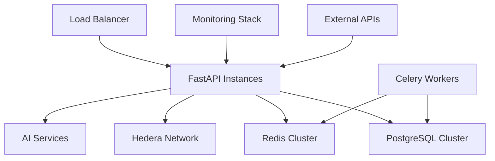
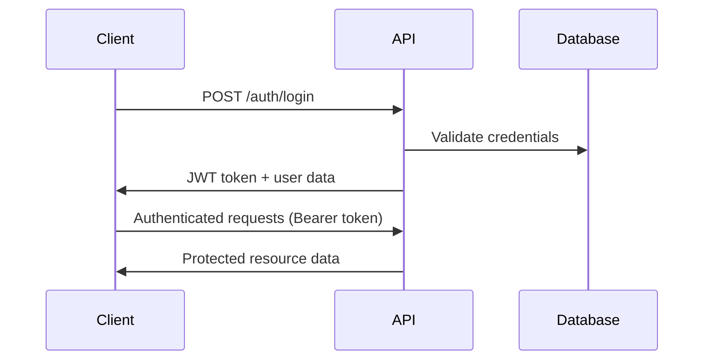
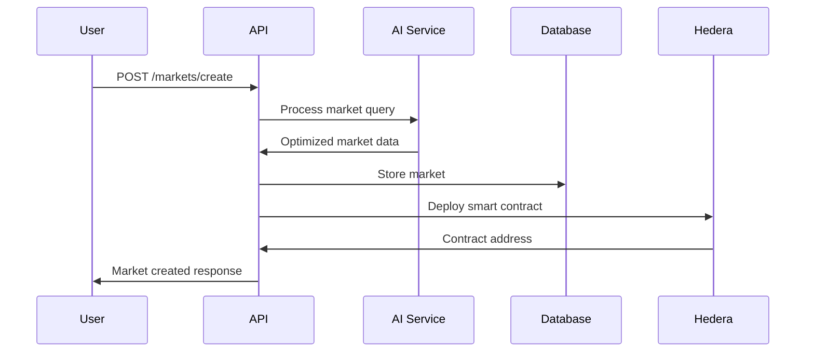

# 🚀 PredictPesa Backend - Product Requirements Document (PRD)

**Version:** 2.0  
**Date:** July 28, 2025  
**Status:** Implementation Ready  

---

## 📋 Executive Summary

PredictPesa Backend is a comprehensive, production-ready FastAPI application that powers Africa's first DeFi-native prediction market platform. Built on Hedera blockchain, it transforms predictions into tradeable DeFi primitives while maintaining mobile-first accessibility for African users.

### 🎯 Mission Statement
*"Democratize prediction markets across Africa by combining AI-powered market creation, Bitcoin staking, and DeFi composability on Hedera's ultra-fast consensus network."*

---

## 🏗️ System Architecture

### Core Technology Stack

| Component | Technology | Version | Purpose |
|-----------|------------|---------|---------|
| **Backend Framework** | FastAPI | 0.104+ | High-performance async API |
| **Database** | PostgreSQL | 14+ | Primary data storage |
| **Cache/Sessions** | Redis | 6+ | Caching & real-time data |
| **Blockchain** | Hedera Hashgraph | Mainnet | Smart contracts & consensus |
| **AI/ML** | OpenAI GPT-4 | Latest | Market creation & analysis |
| **Task Queue** | Celery | 5.3+ | Background processing |
| **Monitoring** | Prometheus/Grafana | Latest | Metrics & observability |

### 🔧 Infrastructure Components



---

## 🎨 Feature Specifications

### 1. 🔐 Authentication & User Management

#### Core Features
- **JWT-based Authentication**: Secure token-based auth with refresh tokens
- **Role-based Access Control**: User, Admin, Moderator, Oracle roles
- **Email Verification**: Required for market creation and staking
- **Password Security**: Bcrypt hashing with configurable rounds
- **Account Recovery**: Email-based password reset flow

#### API Endpoints
```bash
POST /api/v1/auth/register     # User registration
POST /api/v1/auth/login        # User authentication  
POST /api/v1/auth/logout       # Token invalidation
POST /api/v1/auth/refresh      # Token refresh
POST /api/v1/auth/verify-email # Email verification
```

#### User Profile Features
- **Multi-currency Support**: USD, NGN, KES, GHS, ZAR, etc.
- **Geographic Targeting**: Country-specific market filtering
- **Reputation System**: Score based on prediction accuracy
- **Statistics Tracking**: Win rate, total stakes, earnings

### 2. 🤖 AI-Powered Market Creation

#### Natural Language Processing
- **Query Understanding**: Parse natural language market questions
- **Category Classification**: Auto-categorize markets (Politics, Sports, Economics, etc.)
- **Outcome Extraction**: Identify binary/multiple choice outcomes
- **Confidence Scoring**: AI confidence in market viability

#### Market Optimization
- **Title Enhancement**: Improve clarity and engagement
- **Description Generation**: Auto-generate detailed descriptions
- **Tag Suggestion**: Relevant tags for discoverability
- **End Date Optimization**: Suggest optimal market duration

#### API Integration
```python
# Example AI market creation
{
    "query": "Will USD/NGN hit 2000 by Q4 2025?",
    "use_ai_processing": true,
    "category": "economics"
}
```

### 3. ₿ Bitcoin Staking & Tokenization

#### Staking Mechanism
- **BTC Integration**: Wrapped Bitcoin (wBTC) staking
- **Position Tokens**: Mint yesBTC/noBTC HTS tokens
- **Minimum Stakes**: Configurable minimum amounts (0.001 BTC)
- **Maximum Stakes**: Anti-whale protection (10 BTC default)

#### Token Economics
- **HTS Integration**: Hedera Token Service for native tokens
- **Yield Bearing**: Tokens accrue value over time
- **Transfer Fees**: 0.1% protocol fee on transfers
- **Burn Mechanism**: Losing tokens burned on settlement

#### Smart Contract Integration
```solidity
// Market creation flow
MarketFactory.createMarket(market_id, end_date, category)
StakingVault.stakeOnOutcome(market_id, position, amount)
TokenService.mintPositionTokens(user, amount, position)
```

### 4. 🔮 Multi-Source Oracle System

#### Oracle Sources
1. **Chainlink Feeds**: Price data, sports results (60% weight)
2. **Verified Journalists**: Local news verification (30% weight)  
3. **DAO Governance**: Community dispute resolution (10% weight)

#### Resolution Process
- **Data Aggregation**: Collect from multiple sources
- **Confidence Calculation**: Weighted average with reliability scores
- **Threshold Validation**: 95% confidence required for auto-resolution
- **Dispute Mechanism**: 72-hour challenge period

#### Hedera Consensus Service
- **Immutable Records**: All oracle data stored on HCS
- **Topic-based Organization**: Separate topics per market category
- **Cryptographic Proofs**: IPFS hashes for evidence storage

### 5. 🌾 DeFi Integrations

#### Automated Market Maker (AMM)
- **Token Pairs**: yesBTC/noBTC, yesBTC/USDC pools
- **Liquidity Provision**: Users provide liquidity for fees
- **Swap Functionality**: Trade prediction tokens
- **Price Discovery**: Market-driven token pricing

#### Yield Farming
- **LP Token Staking**: Stake liquidity provider tokens
- **Reward Distribution**: Native token rewards (35%+ APY)
- **Compound Interest**: Auto-compounding rewards
- **Multiple Pools**: Different risk/reward profiles

#### Lending Integration
- **Collateral Usage**: Use prediction tokens as collateral
- **Borrowing Power**: Up to 75% LTV ratios
- **Liquidation Protection**: Automated liquidation mechanisms
- **Cross-platform**: Integration with major DeFi protocols

### 6. 📱 Mobile-First African UX

#### USSD Interface
```
*123*PREDICT# - PredictPesa Menu
1. Check Balance
2. View Markets
3. Place Stake  
4. Check Winnings
5. Withdraw Funds
```

#### SMS Integration
- **Transaction Confirmations**: SMS receipts for all operations
- **Market Alerts**: Notifications for resolution/winnings
- **Balance Updates**: Regular balance notifications
- **Multi-language**: English, Swahili, Hausa, French

#### Gasless Transactions
- **Sponsored Transactions**: Platform covers gas fees
- **Meta-transactions**: Users sign, relayers execute
- **Batch Operations**: Multiple operations in single transaction

---

## 📊 Database Schema

### Core Tables

#### Users Table
```sql
CREATE TABLE users (
    id UUID PRIMARY KEY,
    email VARCHAR(255) UNIQUE NOT NULL,
    hashed_password VARCHAR(255) NOT NULL,
    first_name VARCHAR(100),
    last_name VARCHAR(100),
    country_code VARCHAR(2),
    hedera_account_id VARCHAR(50) UNIQUE,
    role user_role DEFAULT 'user',
    is_verified BOOLEAN DEFAULT FALSE,
    created_at TIMESTAMP WITH TIME ZONE DEFAULT NOW()
);
```

#### Markets Table
```sql
CREATE TABLE markets (
    id UUID PRIMARY KEY,
    title VARCHAR(500) NOT NULL,
    description TEXT NOT NULL,
    category market_category NOT NULL,
    creator_id UUID REFERENCES users(id),
    end_date TIMESTAMP WITH TIME ZONE NOT NULL,
    status market_status DEFAULT 'draft',
    total_stake_amount NUMERIC(18,8) DEFAULT 0,
    contract_address VARCHAR(100) UNIQUE,
    created_at TIMESTAMP WITH TIME ZONE DEFAULT NOW()
);
```

#### Stakes Table
```sql
CREATE TABLE stakes (
    id UUID PRIMARY KEY,
    user_id UUID REFERENCES users(id),
    market_id UUID REFERENCES markets(id),
    position stake_position NOT NULL,
    amount NUMERIC(18,8) NOT NULL,
    status stake_status DEFAULT 'pending',
    transaction_hash VARCHAR(100) UNIQUE,
    created_at TIMESTAMP WITH TIME ZONE DEFAULT NOW()
);
```

### Indexes & Performance
- **Composite Indexes**: (user_id, created_at), (market_id, status)
- **Partial Indexes**: Active markets, pending transactions
- **Full-text Search**: Market titles and descriptions
- **Time-series**: Optimized for time-based queries

---

## 🔒 Security Architecture

### Authentication Security
- **JWT Tokens**: RS256 signing with rotating keys
- **Token Blacklisting**: Redis-based revocation
- **Rate Limiting**: Per-user and per-IP limits
- **CORS Protection**: Strict origin validation

### Blockchain Security
- **Multi-sig Wallets**: 3-of-5 signatures for protocol funds
- **Cold Storage**: 90% of funds in offline wallets
- **Smart Contract Audits**: Halborn security review
- **Oracle Manipulation**: Multi-source validation

### Data Protection
- **Encryption at Rest**: Database-level encryption
- **TLS 1.3**: All API communications encrypted
- **PII Anonymization**: GDPR-compliant data handling
- **Audit Logging**: Comprehensive security logs

### Infrastructure Security
- **Container Security**: Distroless images, vulnerability scanning
- **Network Isolation**: VPC with private subnets
- **Secrets Management**: HashiCorp Vault integration
- **Monitoring**: Real-time security alerts

---

## 📈 Performance Requirements

### Scalability Targets
- **Concurrent Users**: 10,000+ simultaneous users
- **Market Creation**: 500 markets/hour peak capacity
- **Stake Processing**: 1,000 stakes/minute
- **API Response Time**: <200ms p95 latency

### Database Performance
- **Connection Pooling**: 20 connections per instance
- **Query Optimization**: <50ms average query time
- **Caching Strategy**: 95% cache hit rate
- **Backup & Recovery**: <4 hour RTO, <1 hour RPO

### Monitoring & Alerting
```yaml
# Key Metrics
- API Latency: p50, p95, p99
- Error Rates: 4xx, 5xx responses
- Database: Connection pool, query performance
- Blockchain: Transaction confirmation times
- Cache: Hit rates, memory usage
```

---

## 🌍 Africa-Specific Features

### Regional Customization
- **Currency Support**: Local fiat currencies with real-time rates
- **Payment Methods**: Mobile money, bank transfers, crypto
- **Language Localization**: Major African languages
- **Cultural Adaptation**: Local holidays, events, customs

### Market Categories
- **Politics**: Elections, policy changes, governance
- **Economics**: FX rates, inflation, GDP growth
- **Weather**: Rainfall patterns, temperature, climate
- **Agriculture**: Crop yields, commodity prices
- **Sports**: Football leagues, athletics, local teams

### Regulatory Compliance
- **KYC/AML**: Tiered verification (>$1000 requires full KYC)
- **Geo-blocking**: Restricted jurisdictions handling
- **Tax Reporting**: Local tax authority integration
- **Data Residency**: African data centers preferred

---

## 🚀 Deployment Architecture

### Container Strategy
```dockerfile
# Multi-stage build for optimization
FROM python:3.11-slim as builder
COPY requirements.txt .
RUN pip install --user -r requirements.txt

FROM python:3.11-slim
COPY --from=builder /root/.local /root/.local
COPY . /app
WORKDIR /app
CMD ["uvicorn", "predictpesa.main:app", "--host", "0.0.0.0"]
```

### Kubernetes Deployment
```yaml
apiVersion: apps/v1
kind: Deployment
metadata:
  name: predictpesa-backend
spec:
  replicas: 3
  selector:
    matchLabels:
      app: predictpesa-backend
  template:
    spec:
      containers:
      - name: backend
        image: predictpesa/backend:latest
        ports:
        - containerPort: 8000
        env:
        - name: DATABASE_URL
          valueFrom:
            secretKeyRef:
              name: predictpesa-secrets
              key: database-url
```

### Environment Configuration
- **Development**: Local Docker Compose
- **Staging**: Kubernetes cluster (Hedera testnet)
- **Production**: Multi-region Kubernetes (Hedera mainnet)

---

## 📋 API Documentation

### OpenAPI Specification
- **Interactive Docs**: FastAPI auto-generated docs at `/docs`
- **Schema Validation**: Pydantic models for all endpoints
- **Error Handling**: Consistent error response format
- **Rate Limiting**: Documented limits per endpoint

### Authentication Flow


### Market Creation Flow


---

## 🧪 Testing Strategy

### Test Coverage
- **Unit Tests**: 90%+ code coverage
- **Integration Tests**: API endpoint testing
- **E2E Tests**: Complete user workflows
- **Load Tests**: Performance validation
- **Security Tests**: Penetration testing

### Test Categories
```python
# Unit Tests
@pytest.mark.unit
def test_market_creation_validation():
    """Test market creation input validation."""
    pass

# Integration Tests  
@pytest.mark.integration
def test_complete_staking_workflow():
    """Test end-to-end staking process."""
    pass

# Load Tests
@pytest.mark.load
def test_concurrent_market_creation():
    """Test system under high load."""
    pass
```

### Continuous Integration
- **GitHub Actions**: Automated testing on PR
- **Code Quality**: Black, isort, flake8, mypy
- **Security Scanning**: Bandit, safety checks
- **Container Scanning**: Trivy vulnerability scans

---

## 📊 Business Metrics & KPIs

### User Engagement
- **Daily Active Users (DAU)**: Target 1,000+ by Q4 2025
- **Monthly Active Users (MAU)**: Target 10,000+ by Q4 2025
- **User Retention**: 30-day retention >40%
- **Session Duration**: Average >5 minutes

### Financial Metrics
- **Total Value Locked (TVL)**: Target $1M+ by Q4 2025
- **Trading Volume**: Daily volume >$10K
- **Protocol Revenue**: 0.1% fee on all transactions
- **Market Creation Rate**: 50+ new markets daily

### Technical Metrics
- **System Uptime**: 99.9% availability SLA
- **API Performance**: <200ms p95 response time
- **Error Rate**: <0.1% of all requests
- **Transaction Success**: >99% blockchain tx success

---

## 🛣️ Implementation Roadmap

### Phase 1: Core MVP (Weeks 1-8)
- ✅ FastAPI application structure
- ✅ Database models and migrations
- ✅ Authentication system
- ✅ Basic market CRUD operations
- ✅ Staking endpoints
- ✅ Oracle data submission
- ✅ Comprehensive testing suite

### Phase 2: Blockchain Integration (Weeks 9-12)
- 🔄 Hedera smart contract deployment
- 🔄 HTS token integration
- 🔄 HCS oracle system
- 🔄 Transaction monitoring
- 🔄 Wallet integration

### Phase 3: AI & DeFi (Weeks 13-16)
- 🔄 OpenAI GPT-4 integration
- 🔄 AMM pool contracts
- 🔄 Yield farming mechanisms
- 🔄 Lending protocol integration
- 🔄 Advanced analytics

### Phase 4: Mobile & Production (Weeks 17-20)
- 🔄 USSD gateway integration
- 🔄 SMS notification system
- 🔄 Mobile app API optimization
- 🔄 Production deployment
- 🔄 Security audit completion

---

## 🎯 Success Criteria

### Technical Success
- [x] **Modular Architecture**: Clean, maintainable codebase
- [x] **Comprehensive Testing**: 90%+ test coverage
- [x] **API Documentation**: Complete OpenAPI specs
- [x] **Security Implementation**: Authentication, authorization, validation
- [x] **Performance Optimization**: Caching, database optimization

### Business Success
- [ ] **User Adoption**: 1,000+ registered users
- [ ] **Market Activity**: 100+ active markets
- [ ] **Transaction Volume**: $100K+ total stakes
- [ ] **Geographic Reach**: 5+ African countries
- [ ] **Platform Stability**: 99.9% uptime

### Innovation Success
- [ ] **AI Integration**: Natural language market creation
- [ ] **DeFi Composability**: Cross-protocol integrations
- [ ] **Mobile Accessibility**: USSD interface adoption
- [ ] **Oracle Reliability**: 95%+ resolution accuracy
- [ ] **Community Growth**: Active user community

---

## 🤝 Team & Resources

### Development Team
- **Backend Lead**: FastAPI, PostgreSQL, Hedera integration
- **Blockchain Developer**: Smart contracts, HTS/HCS integration
- **AI/ML Engineer**: GPT-4 integration, market optimization
- **DevOps Engineer**: Kubernetes, monitoring, CI/CD
- **QA Engineer**: Testing, security, performance validation

### External Dependencies
- **Hedera Network**: Blockchain infrastructure
- **OpenAI**: AI/ML services
- **Cloud Provider**: AWS/GCP for hosting
- **Security Audit**: Halborn or similar firm
- **Legal Counsel**: Regulatory compliance

---

## 📞 Support & Maintenance

### Documentation
- **API Documentation**: `/docs` endpoint with interactive testing
- **Developer Guide**: Setup, configuration, deployment
- **User Manual**: Feature explanations and tutorials
- **Troubleshooting**: Common issues and solutions

### Monitoring & Support
- **24/7 Monitoring**: Prometheus/Grafana dashboards
- **Error Tracking**: Sentry integration for error reporting
- **Performance Monitoring**: APM tools for bottleneck identification
- **User Support**: Discord community, email support

### Maintenance Schedule
- **Daily**: Health checks, log review, performance monitoring
- **Weekly**: Security updates, dependency updates
- **Monthly**: Performance optimization, feature releases
- **Quarterly**: Security audits, infrastructure review

---

## 🎉 Conclusion

The PredictPesa Backend represents a comprehensive, production-ready foundation for Africa's first DeFi-native prediction market platform. With its robust architecture, comprehensive feature set, and focus on African market needs, it's positioned to revolutionize how predictions are made, traded, and monetized across the continent.

**Key Differentiators:**
- 🤖 **AI-First**: Natural language market creation
- ₿ **DeFi-Native**: Tokenized predictions with yield farming
- 📱 **Mobile-Accessible**: USSD interface for basic phones
- 🌍 **Africa-Focused**: Local currencies, languages, and customs
- ⚡ **Hedera-Powered**: Ultra-fast, low-cost transactions

**Ready for Production Deployment** ✅

---

*Built with ❤️ for Africa, powered by Hedera, secured by Bitcoin.*
