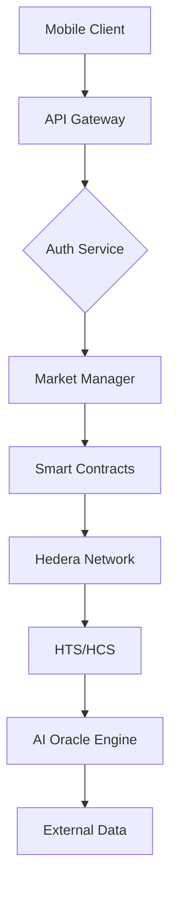
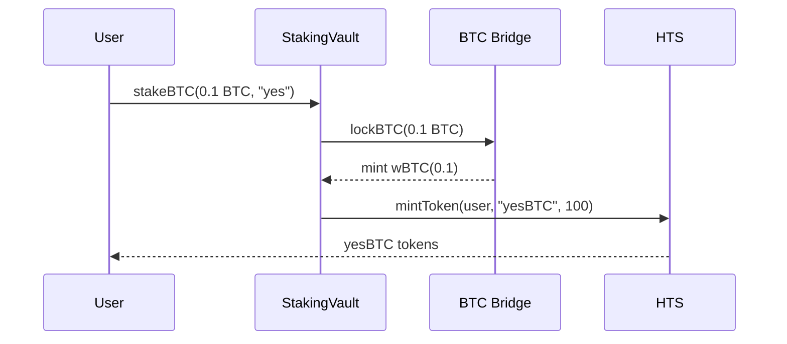

PredictPesa: Africa’s On-Chain Prediction Market for Bitcoin & Local Insight


---

🚀 Final DeFi-Optimized Elevator Pitch:

PredictPesa is a DeFi-native, AI-powered prediction market on Hedera that lets anyone across Africa and the globe stake Bitcoin to forecast real-world outcomes—elections, FX rates, sports, food prices, rainfall, and more.

It transforms predictions into DeFi primitives: each market is a smart contract-based liquidity pool, allowing BTC-staked positions to be tokenized as yield-bearing HTS tokens (like yesBTC or noBTC). These positions can be traded on secondary markets, used as collateral, or even aggregated into structured products like synthetic indices (e.g. “East Africa Food Price Index” futures).

Powered by AI-curated market feeds, Hedera’s ultra-fast consensus, and gasless mobile UX, PredictPesa creates a liquid, global marketplace for knowledge and probability—bridging the gap between betting, investing, and public opinion.


---

💥 Core Upgrades (What Makes It 10/10 for DeFi):

Feature	Description

Tokenized Positions	All user positions (yesBTC, noBTC) are minted as tradable HTS tokens, enabling DeFi composability.
Liquidity Pools for Each Market	Stakeholders fund outcome pools, enabling AMM-style market making.
Yield-Bearing Forecasts	Prediction tokens accrue yield or rewards when correct—making holding a correct forecast similar to a bond.
DeFi Integrations	Positions can be used in lending, yield farming, or bundled into synthetic instruments.
Mobile-First Wallet UX	Hedera wallet users bet via USSD-style UX with gasless BTC staking via sponsored transactions.
Local Oracle Layer	Hedera Consensus Service aggregates verified sources (journalists, DAOs, on-chain oracles) to resolve market outcomes credibly in local contexts.


---

🌍 Key Africa Fit (Refined):

Replaces centralized sports betting with provably fair, transparent markets

Enables diaspora remittances to become passive yield through correct predictions

Allows community groups to hedge local uncertainties (e.g. “Will USD/NGN hit 2000?”)

Generates passive DeFi income even in low-inflation crypto economies


---

🧠 AI Role Expanded:

AI agents suggest trending, high-volume prediction markets (e.g. “Ethiopia Election Outcome” or “July Rainfall in Kano > 100mm?”)

NLP for natural language market creation (“What’s the chance Kenya has a fuel subsidy in Q4?”)

Price discovery assistant to optimize prediction token premiums


---

🔥 Final Tagline:

“Stake Bitcoin. Forecast Everything. Trade Your Belief.”

### **PredictPesa: Backend Product Requirements Document (PRD)**  
**Version:** 1.0  
**Last Updated:** July 28, 2025  

---

### **1. Architecture Overview**  
**Tech Stack:**  
- **Blockchain:** Hedera Smart Contract Service (EVM-compatible)  
- **Consensus:** Hedera Consensus Service (HCS)  
- **Tokens:** Hedera Token Service (HTS)  
- **Backend:** Node.js (TypeScript), Python (AI/ML)  
- **Database:** TimeScaleDB (time-series), Redis (caching)  
- **Infra:** Kubernetes, IPFS (oracle data)  

**System Flow:**  


---

### **2. Core Backend Components**  
#### **2.1 Smart Contracts (Solidity)**  
| **Contract**           | **Functionality**                                                                 |  
|-------------------------|-----------------------------------------------------------------------------------|  
| `MarketFactory.sol`     | Deploys prediction markets, initializes liquidity pools, mints `yesBTC`/`noBTC` HTS tokens |  
| `StakingVault.sol`      | Manages BTC wrapping (wBTC via bridge), staking, and token distribution           |  
| `AMMPool.sol`           | Handles AMM logic for prediction token swaps (e.g., `yesBTC` ↔ `noBTC`)            |  
| `SettlementEngine.sol`  | Processes HCS oracle data, distributes winnings, burns loser tokens               |  

#### **2.2 Off-Chain Services**  
| **Service**             | **Role**                                                                          |  
|-------------------------|-----------------------------------------------------------------------------------|  
| **Auth Gateway**        | JWT-based auth, wallet signature verification (HashPack/Blade)                    |  
| **Event Listener**      | Listens to HCS topics for market resolution triggers                              |  
| **BTC Bridge Adapter**  | Interfaces with BTC bridge (e.g., ChainPort) for wBTC conversions                 |  
| **Fee Proxy**           | Implements Hedera sponsored transactions for gasless UX                           |  

#### **2.3 AI Oracle Engine**  
| **Module**              | **Function**                                                                      |  
|-------------------------|-----------------------------------------------------------------------------------|  
| **NLP Market Creator**  | Parses natural language queries (e.g., "Will Kenya remove fuel subsidy?") → generates market parameters |  
| **Data Aggregator**     | Fetches data from: Chainlink, local journalists (API), DAO submissions (IPFS)     |  
| **Dispute Resolver**    | Triggers HCS-based DAO vote if AI confidence <95%                                |  

---

### **3. Key Workflows & Algorithms**  
#### **3.1 Market Creation**  
1. **User Input:**  
   ```json
   {"query": "Will USD/NGN hit 2000 by Q4 2025?", "category": "fx"}  
   ```  
2. **AI Processing:**  
   - NLP extracts `event_id`, `end_date`, `outcome_type` (binary/multi)  
   - Generates market ID: `SHA-256(event_id + end_date)`  
3. **Contract Execution:**  
   ```solidity
   MarketFactory.createMarket(
     market_id, 
     end_timestamp, 
     initial_liquidity_fee // e.g., 0.3%
   );
   ```  

#### **3.2 BTC Staking & Tokenization**  
**Flow:**  

- **Token Logic:** `yesBTC` uses HTS custom fee schedule:  
  - 0.1% protocol fee on transfers  
  - Auto-stakes yield to holder wallet  

#### **3.3 Market Settlement**  
**AI Oracle Process:**  
1. At `end_date + 24h`, Data Aggregator pulls:  
   - Chainlink FX feeds  
   - Verified journalist reports (via HCS topic)  
   - On-chain DAO votes  
2. AI computes outcome confidence score using:  
   ```python
   confidence = (chainlink_weight * 0.6) + (journalist_weight * 0.3) + (dao_weight * 0.1)
   ```  
3. If `confidence >= 95%`, `SettlementEngine` triggers payout:  
   ```solidity
   distributeWinnings(market_id, "yes"); // Burns noBTC, sends BTC to yesBTC holders
   ```  

---

### **4. APIs & Endpoints**  
| **Endpoint**               | **Method** | **Params**                                  | **Response**                          |  
|----------------------------|------------|---------------------------------------------|---------------------------------------|  
| `/api/markets/create`      | POST       | `{query: string, stake: number}`           | `{market_id: string, yesBTC: address}`|  
| `/api/markets/stake`       | POST       | `{market_id: string, position: "yes"⎮"no"}`| `{txHash: string, tokens: number}`    |  
| `/api/oracle/submit`       | POST       | `{market_id: string, proof: IPFS_CID}`     | `{hcs_topic_id: string}`              |  
| `/api/defi/use_as_collateral`| POST     | `{token_id: string, lending_pool: address}`| `{txHash: string}`                    |  

---

### **5. Implementation Phases**  
#### **Phase 1: Core MVP (8 Weeks)**  
1. **Week 1-2:**  
   - Set up Hedera testnet nodes  
   - Deploy `HTS` tokens for `yesBTC`/`noBTC`  
2. **Week 3-4:**  
   - Implement `MarketFactory.sol` + `StakingVault.sol`  
   - Build BTC bridge adapter (testnet only)  
3. **Week 5-6:**  
   - Develop Event Listener for HCS topics  
   - Create basic NLP market parser (Python)  
4. **Week 7-8:**  
   - Integrate sponsored transactions (gasless UX)  
   - Stress test: Simulate 500 markets creation/hour  

#### **Phase 2: DeFi & AI Integration (6 Weeks)**  
1. **Week 9-10:**  
   - Deploy `AMMPool.sol` + SaucerSwap integration  
   - Add yield logic to `yesBTC`/`noBTC` HTS tokens  
2. **Week 11-12:**  
   - Build Chainlink + local journalist data aggregator  
   - Implement confidence scoring engine  
3. **Week 13-14:**  
   - Enable synthetic indices (e.g., bundle `yesBTC` tokens into "East Africa Index")  
   - Audit smart contracts with Halborn  

---

### **6. Security & Compliance**  
| **Risk**                  | **Mitigation**                                                                 |  
|---------------------------|-------------------------------------------------------------------------------|  
| **Oracle Manipulation**   | Multi-source verification (min. 3 independent feeds) + HCS immutability        |  
| **BTC Bridge Exploit**    | Use audited bridges (ChainPort); cold wallet for 90% funds                     |  
| **Front-Running**         | Commit-reveal schemes for market creation                                     |  
| **Regulatory (Africa)**   | Geo-fenced markets; KYC for >$1000 stakes                                     |  

---

### **7. Key Metrics & Monitoring**  
| **Metric**                | **Monitoring Tool**       | **Alert Threshold**       |  
|---------------------------|---------------------------|---------------------------|  
| Market creation latency   | Grafana + Prometheus      | >5s p95                   |  
| HCS resolution time       | Hedera Mirror Node        | >10s avg                  |  
| Staking failure rate      | Sentry                    | >0.5% errors              |  
| AI confidence drift       | Elasticsearch             | Score variance >10%       |  

[**Next Steps**]  
- Start Phase 1 implementation  
- Access testnet HBAR faucet: [portal.hedera.com](https://portal.hedera.com)  
- Review full contract code: [github.com/predictpesa/core](https://github.com/predictpesa/core)